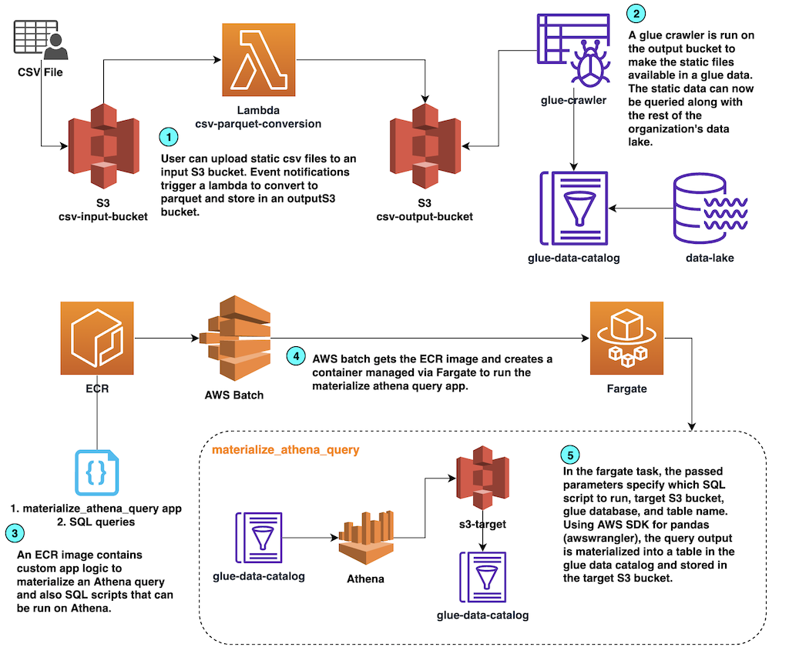

# Materializing Athena Queries using AWS Batch 

## Context
Customers frequently have data lakes built on top of S3 and look for an easy way to do SQL based ETL on their "small" datasets. Particularly when an organization is early on in their analytics/data strategy, their analysts may not have use cases "large" enough to warrant distributed ETL tools such as Glue or EMR. Athena can easily be used for SQL based transformations/exploration but there's no out of the box way to orchestrate its query capabilities. This solution provides a way to orchestrate SQL based ETLs by using [Fargate based AWS Batch](https://docs.aws.amazon.com/batch/latest/userguide/fargate.html) jobs to run a custom app that uses [AWS SDK for Pandas](https://github.com/aws/aws-sdk-pandas) to run Athena queries and materialize its output into the Glue Data Catalog.

## Architecture


## Deployment and Usage

### Prerequisites
* Configure AWS CLI credentials. The recommended way would be to use [named profiles as described here](https://docs.aws.amazon.com/cli/latest/userguide/cli-configure-profiles.html)
* Install [CDK CLI](https://docs.aws.amazon.com/cdk/v2/guide/cli.html)
* Python3 [with venv](https://docs.python.org/3/library/venv.html) - used for `cdk` development as described below
* [Docker](https://www.docker.com/)
* Basic knowledge of Make commands (to run makefile commands when developing app logic in `src`)

#### CDK Environment installation
After installing the above prerequisites  and before deploying any of the stacks below, make sure cdk dependencies are installed.

* `cd` into the `cdk` directory
* Create a virtual environment: `python3 -m venv .venv`
* Activate it: `source .venv/bin/activate`
* Install the dependencies: `pip install -r requirements.txt`
* Now the following deployment steps can be done

### Lambda based static file ingestion
A common BI challenge is when teams have some custom dataset that they want as part of Reporting. This may be a dataset that is manually curated or has sporadic/infrequent updates. We commonly see this as "Excel or CSV" data owned by some business team. Due to the sporadic updates and "away team" ownership, there may not be an easy way to create an automated pipeline to get this data into the data lake. The first component of this solution allows this type of data to become a part of the datalake.

* Deploy the stack with `cdk deploy FileConversionLambdaStack --profile some-named-profile-here`
* The stack will create an input s3 bucket, output s3 bucket, a lambda function to convert csv files, and a glue crawler,
* Upload a csv dataset into the created input s3 bucket
* An s3 event rule will trigger the lambda, convert the csv into parquet, store it in the output bucket, and make it available in the glue data catalog
* This once isolated data can now be queried and combined with the rest of your data lake in your Glue data catalog.

### Orchestrating an Athena Query with AWS Batch
The next part of the solution orchestrates Athena based ETLs. Using this approach, an initial base architecture can be deployed initially. Afterwards, BI Engineers/Analysts can primarily focus on writing SQL transformations according to business need with minimal attention needed to  manage additional infrastructure. 
* SQL they write can go in this same repository structure under the `sql` directory. We go through an example in this readme. 
* Additionally, for every SQL based ETL, they will need to define a simple CDK stack that represents the job's orchestration. The example here is in `cdk/stacks/batch_job_stack.py`

**Initial setup**
1. First deploy base infra stack with `cdk deploy BatchMaterializeQueryStack --profile some-named-profile-here`
2. cd into the `src` directory and build the docker image with `make build-image-nc`. This defines the app logic to run Athena ETLs.
3. Go to the AWS console, ECR, and look for the repo created in step 1 by BatchMaterializeQueryStack. Follow the instructions to push the image built in step 2 into this ECR repo there following the instructions.
    * **Note:** The image needs to be repushed in case there are app logic updates. It's also recommended to have some CI/CD process to rebuild/push this image regardless of updates so that up to date versions of dependencies can be used.

**Authoring SQL based ETLs**
1. Use the Athena console to develop/test queries on the data catalog. Once your query is finalized, put the `.sql` script in the `sql_jobs` directory under some project. The example here is `src/sql_jobs/some_project/sample-nyc-covid.sql`
2. Create a stack to define the job. See `batch_job_stack.py` as an example. In it, you will define:
* source table(s) for the ETL
* destination table/glue DB for the materialized result
* IAM permissions for those locations
* the Batch job definition
  * The included helper functions enable BI authors to define the above with minimal custom code.
  * Note, in the job definition, the syntax for the `cmd` parameter defines the logic for the ETL. It is the command that will be passed to the docker container. The format is:
  ```
  ['python3',
  'scriptname.py',
  'sql query path',
  'target S3 bucket',
  'target Glue DB',
  'Target Glue Table (where materialized results are stored)',
  'Table description',
  'S3 bucket to hold tempoarary Athena query results']
  ```
  For example:
  ```
  ['python3', 
  'materialize_athena_query.py',
  'some_project/sample-nyc-covid.sql',
  'TARGET_S3_BUCKET',
  'TARGET_GLUE_DB',
  'TARGET_GLUE_TABLE',
  'Table Description',
  'TMP_S3_BUCKET']
  ```
  See the `materialize_athena_query.py` file for more details.

3. Add the stack you created in the `cdk/stacks/__init__.py` file
4. Declare the stack in the `cdk/stacks/app.py` file
5. Deploy the job with the cdk cli. EG: `cdk deploy SampleJobStack --profile some-named-profile-here`


# Raw Dev Notes

## TODO Open questions
* Double check: in the lambda ingestion, how does it know what table/DB to make the csv a part of
* How to schedule the actual batch job (eg: in batch_job_stack). Forget if i included a place to put cron scheduling syntax

## App Structure
The app is structured as follows
```
.
├── cdk
│   ├── app.py
│   ├── requirements.txt
│   └── stacks
│       ├── __init__.py
│       ├── batch_job_stack.py
│       ├── helpers
│       │   ├── ...
│       └── lambda_file_conversion_stack.py
└── src
    ├── Dockerfile
    ├── Makefile
    ├── file_conversion_lambda
    │   └── lambda_func.py
    ├── materialize_athena_query.py
    └── sql_jobs
        └── some_project
            └── some-sql-file.sql
```
* The `cdk` directory contains all infrastructure for the solution. The `stacks` directory will be where new stacks are added to define ETL jobs. `batch_job_stack.py` is an example. The instructions above go through deployment. 
* The `src` directory contains app logic. `materialize_athena_query.py` is the main app to orchestrate ETLs and `file_conversion_lambda/lambda_func.py` is the logic for the file conversion lambda.
* In the `sql_jobs` directory, sql scripts are organized into projects which the app can pickup and run as an ETL logic.
* The intention is that the `cdk/requirements.txt` has necessary modules for cdk development and deployment. The code in `src` is meant to be run in the docker image. The Dockerfile installs any dependencies for the python code.
* Common build and test commands are included in `src/Makefile` for simplicity.


## Local Testing
* For local testing, use an AWS CLI named profile
* cd into the `src` directory
* Build the image locally with `make build-image-nc`
* once the image is built, it can be run with `AWS_PROFILE=profile_name make run-local docker`. This passes the named profile's credentials to the docker container and runs the app logic locally.
* if you make code changes, both the above make commands should be run so the docker image can pickup the changes

## CDK Notes
* most commands for building should be in the makefile
* Create virtual env for cdk: `python3 -m venv .venv`
* Activate: `source .venv/bin/activate`
* Install Reqs: `pip install -r requirements.txt`
* Update requirements.txt with: `pip freeze >> requirements.txt`

## Developing/Debugging script iteratively
Debugging the application code can get cumbersome with the above testing method as the image needs to be built everytime. If the only changes that you are making to debug are only code changes without installing new packages, you can mount the `src` directory into the docker container and more quickly test.
Build docker image and run with src and credentials directory mounted
```
docker run --platform linux/amd64 --name bme \
    -v /Users/yourusername/.aws:/root/.aws \
	-v /Users/yourusername/path/to/code/repo/:/src \
    -itd batch-materialize-env
docker exec -it bme bash
```

In docker shell run scripts with `AWS_PROFILE=rg-dev-bme python3 ./src/batch-materialize-query/src/run_athena_query.py`